# Análise Exploratória – Manufacturing Defects Dataset


#### Coteúdo
- [Introdução](#-introdução)
- [Ferramentas](#️-ferramentas)
- [Análise Exploratória de Dados](#-análise-exploratória-de-dados)
- [Como usar](#️-como-usar)
- [Contato](#-contato)

## 📝 Introdução

O dateset contém informações sintéticas relacionadas a defeitos de fabricação observados durante os processos de controle de qualidade. Inclui informações como tipo de defeito, data de detecção, local do defeito, nível de gravidade, método de inspeção utilizado e custos de reparo.

### Metas e objetivos
- **Objetivos:** O principal objetivo deste projeto é investigar tendências e padrões por trás dos dados.
- **Metas:** Buscar insights para o setor de qualidade da fábrica fictícia, e construir um *dashboard* utilizando o *Microsoft Power BI* para fazer um acompanhamento dos defeitos. 

## 🛠️ Ferramentas
- **Python 3.12+**
    - **Bibliotecas**: NumPy, Pandas, Matplotlib, Seaborn. 
- **Microsoft Power BI**

## 📊 Dataset

|Feature|Descrição|
|---|---|
|``defect_id``|Identificador único do defeito|
|``product_id``|ID do produto associado com o defeito|
|``defect_type``|Categória do defeito (cósmetico, funcional ou estrutural)|
|``defect_description``|Descrição do defeito|
|``defect_date``|Data de quando o defeito ocorreu|
|``defect_location``|Local onde o defeito foi encontrado (superficie, componente)|
|``severity``|Severidade do defeito (pequena, moderada, crítica)|
|``inspection_method``|Método de inspeção (inspeção visual, teste automatizado)|
|``repair_cost``|Custo do reparo|

Dados originais podem ser encontrados no [Kaggle](https://www.kaggle.com/datasets/fahmidachowdhury/manufacturing-defects).

## 🔎 Análise Exploratória de Dados
### Estatísticas Descritivas
- ``repair_cost`` é a única variável numérica neste conjunto de dados;
- A média é um pouco maior que a mediana mas a distribuição é próxima da normal;
- Existem 100 produtos únicos.

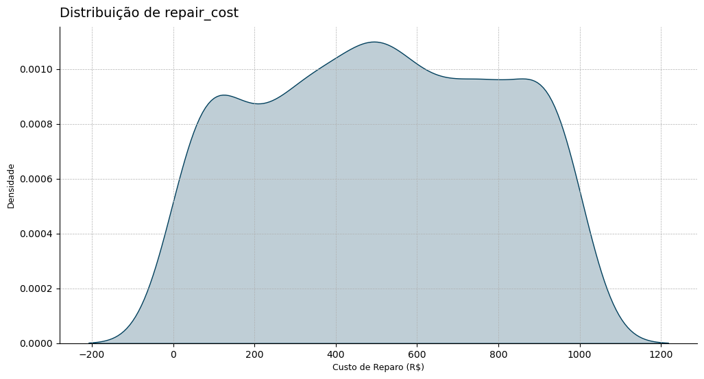

- Os defeitos mais frequentes são estruturais, a localização mais comum é na superfície, e de menor severidade. 
- Janeiro foi o mês com maior ocorrência de defeitos

### Produtos

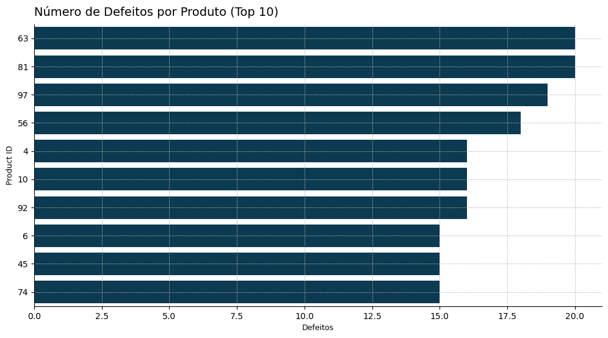

- Quantidade média de defeitos: 10.0
- Desvio padrão da quantidade de defeitos: 3.60
- Mediana da quantidade de defeitos: 10.0

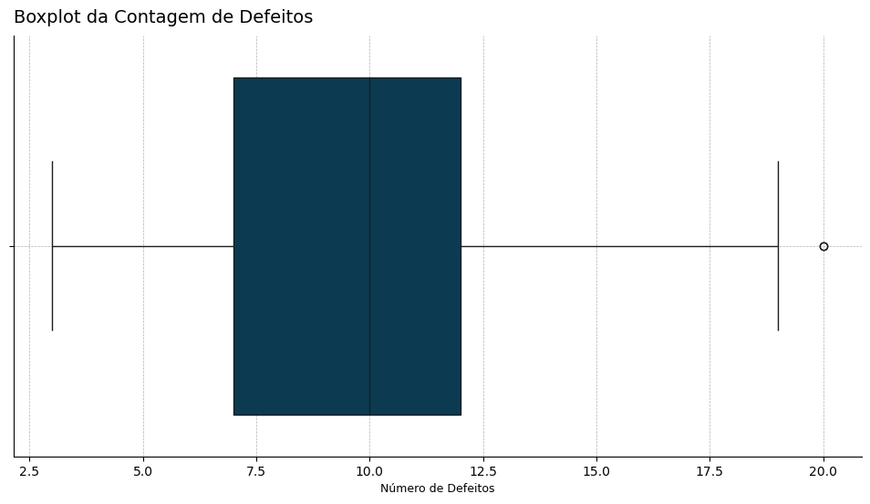

- Produtos com uma alta quantidade de defeitos como os 63 e 81 precisam ter seu processo produtivo investigado e melhorado com urgência, a frequência de defeitos pode ser considerada extrema;
- Estes produtos tem em média duas vezes mais defeitos que o padrão; 
- Os outros produtos no top 10 também necessitam uma investigação para melhora dos processos.

Vamos prosseguir para os custos.

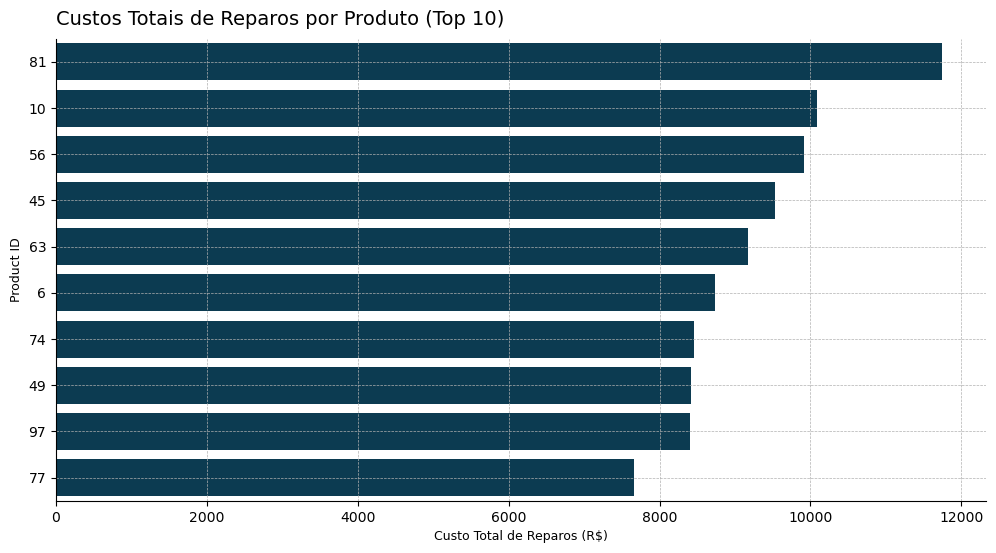

- Junto da alta quantidade de feitos o Produto 81 é aquele que mais causou prejuízos financeiros com reparos (custo médio de R$ 587,03 por reparo);
- Maioria dos produtos que estão nesta lista, estão no ranking de quantidade de defeitos.

### Tipo, local e severidade

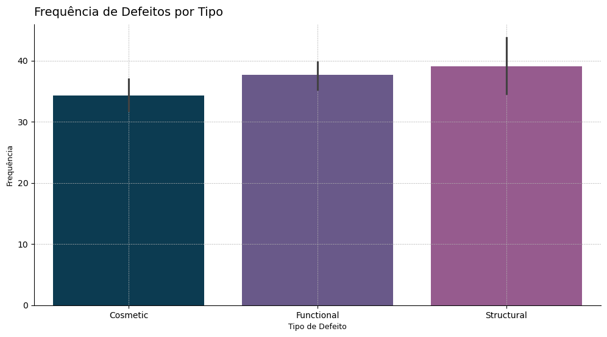

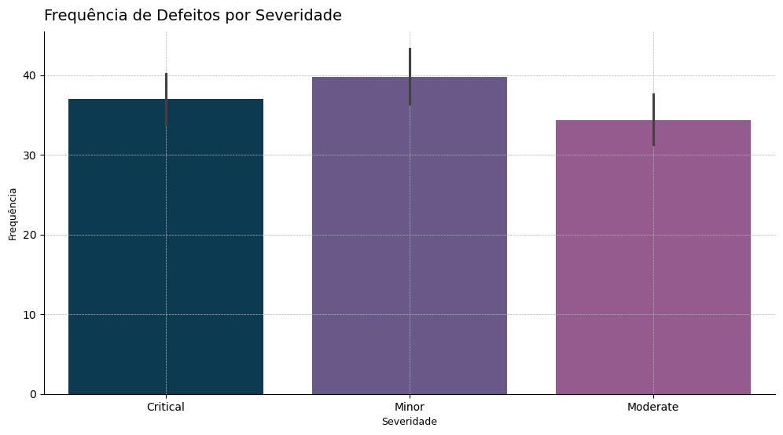

- Defeitos estruturais são os mais frequentes;
- Defeitos de menor severididade são os mais comuns, mas seguidos dos críticos (maior severidade);
- É necessário buscar as razões dentro do processos produtivo da quantidade de defeitos estruturais.

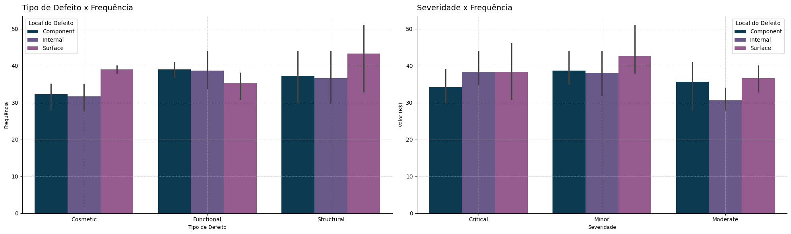

#### Tipo de defeito

- Os defeitos estrutrais tem sido mais frequentes na superfície dos Produtos, a superfície também é onde os defeitos cosméticos também são maioria;
- Existe uma alta quantidade de defeitos funcionais e estruturais na parte interna dos Produtos;
- Defeitos funcionais tem uma alta frequência quando comparados aos outros, apesar da menor quantidade de defeitos na superfície. 

#### Severidade

- Defeitos de menor severidade são os de maior frequência, eles se repetem em quantidade mais elevada na superfície;
- Os defeitos críticos tem volume maior nas partes internas e de superífcie dos Produtos;
- Defeitos moderados tem menor frequência.

O processo de fabricação dos produtos precisa uma atenção especial nas parte superficiais, componentes internos também necessitam de uma melhor inspeção. 

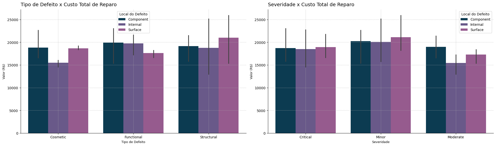

#### Tipo de defeito

- Os defeitos estruturais na superfície sãos o que causam maior prejuízo financeiro; 
- Defeitos funcionais internos e nos componentes estão praticamente empatados na segunda colação de maiores custos;

#### Severidade

- Por seu alto volume, defeitos de menor severidade são os que causam maiores prejuízos, novamente a superfície é uma área em que se deve ter alerta;
- Danos moderados aos componentes também mostram alto custo de reparo.

### Frequência e o período analisado

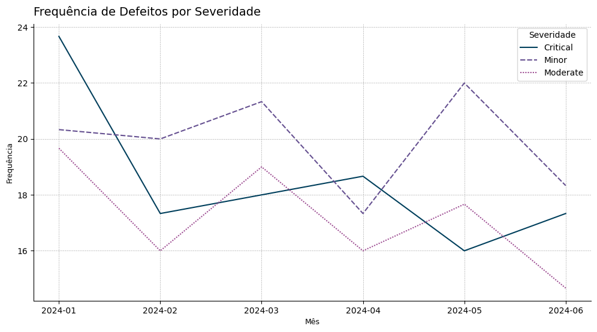

- Apesar da grande queda na frequência, existe tendência de aumento na quantidade de defeitos críticos;
- Em maio de 2024 houve um grande aumento no número de defeitos moderados e críticos;
- Existe um ciclo de aumento e diminuição na frequência de defeitos, deve ser investigado o que está por trás dos picos de aumento após uma melhora;

Investigar o que levou ao aumento de defeitos de severidade crítica entre maio e junho pode levar a soluções para evitar que o mesmo aconteça os defeitos menos severos e moderados.

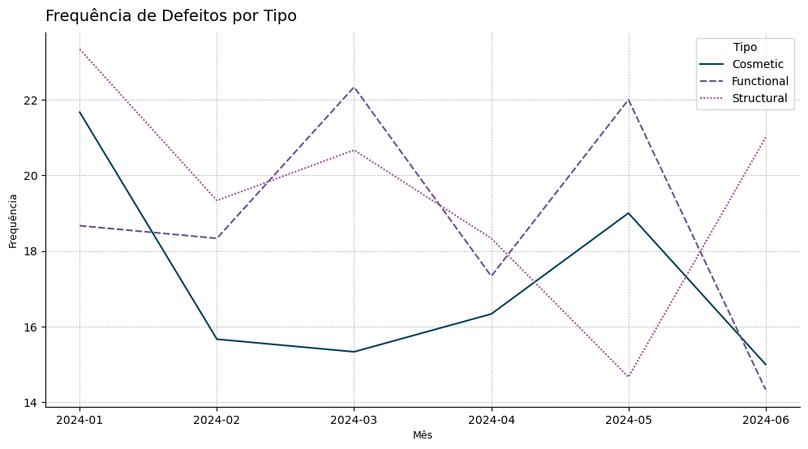

- O ciclo de melhora/piora é mais acentuado quando olhamos por tipo;
- Assim como quando observamos em relação a severidade, buscar no processo produtivo o que está causando o aumento dos defeitos estrurais pode dar uma direção para evitar que o ciclo se repita em defeitos cósmeticos e funcionais.

### Conclusões
#### Sobre os produtos

- Os Produtos 63, 81, 97, 56,  4, 10, 92,  6, 45, 74 são os que apresentam maior quantidade de defeitos;
- 63 e 81 apresentam valores extremos na frequência de defeitos;
- O Produto 81 além de ser o que mais frequentemente apresenta defeitos, é o que causou mais prejuízos com reparos.

#### Sobre os defeitos

- Defeitos estruturais são os mais frequentes e apresentam tendência de aumento na frequência, equanto os oturos estão em baixa;
- Defeitos de severidade crítica estão com uma tendência de aumento em frequência, o restante apresenta tendência de baixa;
- Existe um ciclo de melhora/piora em relação a frequência de defeitos que deve ser investigado; 
- A superífcie é o local de mais frequente ocorrência de defeitos, com destaque para defeitos estrurais;
- Os defeitos de menor severidade são os mais frequentes.

#### Insights

Vejo a necessidade de realizar um mapeamento do processo de produção e aplicar ferramentas como o DMAIC do Six Sigma, para buscar a causa raíz das falhas estrurais na produção dos componentes de Superfície dos produtos. Um caminho apontado pela análise é começar pela investigação do que vem causando os ciclos de aumento e queda do número de defeitos nos Produtos com foco (1) em defeitos de severidade crítica, (2) defeitos do tipo estrurais que estão em tendência de crescimento, antes que os outros aspectos também aumentem a frequência de defeitos, e (3) nos defeitos na superfície dos produtos. 

## ⚙️ Como usar
Você pode acessar o *dashboard* no [Power BI Service](https://app.powerbi.com/view?r=eyJrIjoiNmFlYWU5OTgtYjdiYi00MGNjLTgzMzMtYzkyYTk1OTJlYzlmIiwidCI6ImJmOWUzNDgwLTkyM2UtNDNmMS04OTE1LTlmMmY3YjY2NTc0MSJ9). 

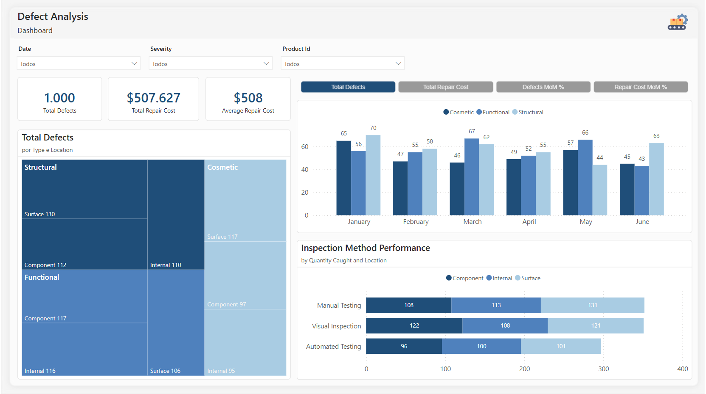

#### Instalação
```bash
git clone https://github.com/datalopes1/manufacturing_defects.git
```

No repositório estão localizados o arquivo `.pbix` com as medidas DAX e Modelagem de Dados realizada. Além do Jupyter Notebook com a análise prévia. 

## 📞 Contato
- LinkedIn: https://www.linkedin.com/in/andreluizls1
- Portfolio: https://sites.google.com/view/datalopes1
- E-mail: datalopes1@proton.me